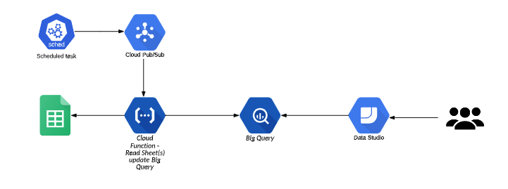

# Migration Dashboard

This project has been created to run against the Migration sheet, download specific sheet data, and then upload it to Big Query. Special queries are then handled to create views for DataStudio.



## Project

The organization of the project is as follows. Since most of the items are specific to this, the modules are part of this project. If these are helpful for other projects, these could be moved to their own repos.

```bash
├── backend.tf
├── files
│   ├── Archive.zip
│   ├── main.py
│   └── requirements.txt
├── locals.tf
├── main.tf
├── modules
│   ├── alerts
│   │   ├── README.md
│   │   ├── main.tf
│   │   └── variables.tf
│   ├── bigquery
│   │   ├── README.md
│   │   ├── main.tf
│   │   └── variables.tf
│   ├── function
│   │   ├── README.md
│   │   ├── main.tf
│   │   ├── outputs.tf
│   │   └── variables.tf
│   └── scheduler
│       ├── README.md
│       ├── main.tf
│       ├── outputs.tf
│       └── variables.tf
├── provider.tf
├── resources
│   └── dashboard-architecture.png
└── variables.tf
```

## Cloud Function

The cloud function is inside `files/main.py` This function has two run options: local or inside GCP. When running locally `main()` is called and the sheet data needs to be updated directly from within it. When running inside GCP it is triggered from PUB/SUB. `sheet_pubsub()` is called and decodes the base64 encoded message.  The message originates from Cloud Scheduler, which Terraform manages and updates to the scheduler should be done as code.

## Terraform

Terraform is the main part of this project and used to manage the entire architecture.

### Requirements

The following services have been enabled in the project:

| Name | Service |
|------|---------|
| sheets | sheets.googleapis.com |
| pubsub | pubsub.googleapis.com |
| cloud scheduler | cloudscheduler.googleapis.com |
| Big Query | bigquery.googleapis.com |

### Providers

| Name | Version |
|------|---------|
| google | n/a |

### Inputs

| Name | Description | Type | Default | Required |
|------|-------------|------|---------|:--------:|
| cf\_bucket\_name | Bucket that the cloud function Archive.zip will be uploaded to. | `string` | `"mck-dashboard-update"` | no |
| cf\_service\_account\_email | Service account for the cloud function to 'runas' | `string` | `"mig-dashboard-dev-e918-1@mig-dashboard-dev-e918.iam.gserviceaccount.com"` | no |
| comparison | How to compare the log filters versus the threshold value | `string` | `"COMPARISON_GT"` | no |
| dataset\_description | description of the dataset | `string` | `"This is mckesson databoard dataset"` | no |
| dataset\_id | dashboard dataset id | `string` | `"mck_dashboard_data"` | no |
| display\_name | Name of the alert. | `string` | `"alert-cloud-function-error"` | no |
| duration | How often to check. | `string` | `"60s"` | no |
| function\_mem\_amount | Amount of memory to allocate to the cloud function. | `number` | `512` | no |
| labels | Map of labels for project | `map(string)` | {  "environment": "development"} | no |
| location | dataset location | `string` | `"US"` | no |
| log\_filter | Filter for the alert to look for in the logs | `string` | `"resource.type=\"cloud_function\" resource.labels.function_name=\"dashboard_update\" resource.labels.region=\"us-central1\" textPayload:\"crash\" OR \"failed\""` | no |
| log\_name | Log for the Alerts to watch | `string` | `"cloud-function-log-metrics"` | no |
| mck\_views | list of views needs to created | `map(string)` | {  "mck_dc_all_workloads": "SELECT  'Cogent' as dc, Unconfirmed_App, Application, Disposition, CAST(Server_Count AS INT64) AS Server_Count , CAST(Desktop_Count AS INT64) AS Desktop_Count ,PARSE_DATE('%Y%m%d',_TABLE_SUFFIX) as Date FROM `mig-dashboard-dev-e918.mck_dashboard_data.dc_cogent_*` union all \nSELECT  'Markham' as dc,Unconfirmed_App, Application, Disposition, CAST(Server_Count AS INT64) AS Server_Count , CAST(Desktop_Count AS INT64) AS Desktop_Count ,PARSE_DATE('%Y%m%d',_TABLE_SUFFIX) as Date FROM `mig-dashboard-dev-e918.mck_dashboard_data.dc_markham_*` union all \nSELECT  'Unipri' as dc, Unconfirmed_App, Application, Disposition, CAST(Server_Count AS INT64) AS Server_Count , CAST(Desktop_Count AS INT64) AS Desktop_Count ,PARSE_DATE('%Y%m%d',_TABLE_SUFFIX) as Date FROM `mig-dashboard-dev-e918.mck_dashboard_data.dc_uniprix_*` union all \nSELECT  'Viscount' as dc, Unconfirmed_App, Application, Disposition, CAST(Server_Count AS INT64) AS Server_Count , CAST(Desktop_Count AS INT64) AS Desktop_Count ,PARSE_DATE('%Y%m%d',_TABLE_SUFFIX) as Date FROM `mig-dashboard-dev-e918.mck_dashboard_data.dc_viscount_*`\n",  "mck_dc_all_workloads_dc_rollup": "    SELECT DISTINCT\n    Source\n    ,sum(case when Sunset_in_Place = \"TRUE\" then 1 else 0 end) AS Sunset_in_Place\n    ,sum(case when Migrate_to_GCP = \"TRUE\" then 1 else 0 end) AS Migrate_to_GCP\n    ,sum(case when Citrix = \"TRUE\" then 1 else 0 end) AS Migrate_to_Citrix\n    ,sum(case when Migrate_to_Azure = \"TRUE\" then 1 else 0 end) AS Migrate_to_Azure\n    ,sum(case when Modernization = \"TRUE\" then 1 else 0 end) AS Modernization\n    ,sum(case when Unassessed = \"TRUE\" then 1 else 0 end) AS Unassessed\n    ,date\n    FROM mig-dashboard-dev-e918.mck_dashboard_data.mck_dc_all_workloads_details \n    WHERE  date = CURRENT_DATE()\n    GROUP BY Source, date\n",  "mck_dc_all_workloads_details": "    SELECT Source, Server, OS, Normalized_OS, Power_State, Application_Lookup, Confirmed_Application, MW_Project_Name, Sunset_in_Place,\n    Citrix, Modernization, Migrate_to_Azure, Migrate_to_GCP, Unassessed, Migration_Scheduled, Migration_Succeeded, In_flight_Initiative,\n    Project_Owner, Tech_Owner, BAP_ID, Lean_IX_ID, Archer_ID, Host_CPU, Host_Mem,Allocated_Storage,Rationale, Server_Function_Notes, \n    Wave, Wave_Order, Environment,Destination_Project,Project_Request_ID, PARSE_DATE('%Y%m%d',_TABLE_SUFFIX) as Date\n  ,(case \n      when Sunset_in_Place = 'TRUE' then 'Sunset'\n      when Citrix = 'TRUE' then 'Citrix'\n      when Modernization = 'TRUE' then 'Modernization'\n      when Migrate_to_Azure = 'TRUE' then 'Azure'\n      when Migrate_to_GCP = 'TRUE' then 'GCP'\n      when Unassessed = 'TRUE' then 'Unassessed Server ' \n      else 'other'\n    end) as disposition\n\n    FROM `mig-dashboard-dev-e918.mck_dashboard_data.dc_all_*`\n    Order by Date\n",  "mck_dc_dashboard": "  SELECT DC, \n  SUM(Planned_InFlight_Migration) AS Planned_InFlight_Migration,\n  SUM(Sunset_in_Place) AS Sunset_in_Place , \n  SUM(Citrix) AS Citrix_Migration,\n  SUM( Migrate_to_Azure) AS Migrate_to_Azure ,\n  SUM( Modernization) AS Modernization,\n  SUM( Migrate_to_GCP) AS Migrate_to_GCP,\n  SUM(UnAccessed) AS UnAccessed,\n  Date\n  FROM (\n        SELECT  DISTINCT CASE WHEN Source = 'UNIPRIX2' OR Source = 'UNIPRIX1' THEN 'UNIPRIX' ELSE Source END As DC, \n        COUNTIF( Has_separate_project_or_effort = 'TRUE') AS Planned_InFlight_Migration,\n        COUNTIF(Sunset_in_Place = 'TRUE') AS Sunset_in_Place, \n        COUNTIF(Citrix = 'TRUE') AS Citrix,\n        COUNTIF(Migrate_to_Azure = 'TRUE') AS Migrate_to_Azure,  \n        COUNTIF(Modernization = 'TRUE') AS Modernization,\n        COUNTIF(Migrate_to_GCP = 'TRUE') AS Migrate_to_GCP,\n        COUNTIF(Unassessed = 'TRUE') AS UnAccessed,\n        PARSE_DATE('%Y%m%d',_TABLE_SUFFIX) as Date \n        FROM `mig-dashboard-dev-e918.mck_dashboard_data.dc_all_*`\n        GROUP BY Source, _TABLE_SUFFIX \n        ) \n  GROUP BY DC, Date\n"} | no |
| notification\_email\_list | Map of a name to an email for notifications. | `map(string)` | {  "ashwani-sharma": "ashwani.sharma@mavenwave.com",  "travis-mcvey": "travis.mcvey@mavenwave.com"} | no |
| prefix | Prefix that resources will be created with. | `string` | `"dev"` | no |
| project\_id | Project to deploy the resources to. | `string` | `"mig-dashboard-dev-e918"` | no |
| pubsub\_topic | Topic that is created for the cloud scheduler and function to interact | `string` | `"mck-dashboard-update"` | no |
| region | Region to deploy the resources to. | `string` | `"northamerica-northeast1"` | no |
| sheet\_information | The Google Sheet ID, bigquery dataset to upload the sheet id to, and then specific sheets and ranges to read from. | object({    sheet_id = string    data_set = string    sheets   = list(map(string))  }) | {  "data_set": "mig-dashboard-dev-e918.mck_dashboard_data",  "sheet_id": "1oRULNbJj5sG7HsVvA4ySD5w3LOX_P_-g5nvazkk2z58",  "sheets": [    {      "name": "dc_cogent",      "range": "Cogent Dashboard!F1:J25"    },    {      "name": "dc_markham",      "range": "Markham Dashboard!F1:J25"    },    {      "name": "dc_uniprix",      "range": "Uniprix Dashboard!F1:J60"    },    {      "name": "dc_viscount",      "range": "Viscount Dashboard!F1:J15"    },    {      "name": "dc_tracker",      "range": "DataCenter Tracker!A1:K7"    },    {      "name": "dc_all",      "range": "Master Server Inventory!A1:BZ1000"    }  ]} | no |
| threshold\_value | Threshold to be compared against | `string` | `"0.001"` | no |

### Outputs

No output.
